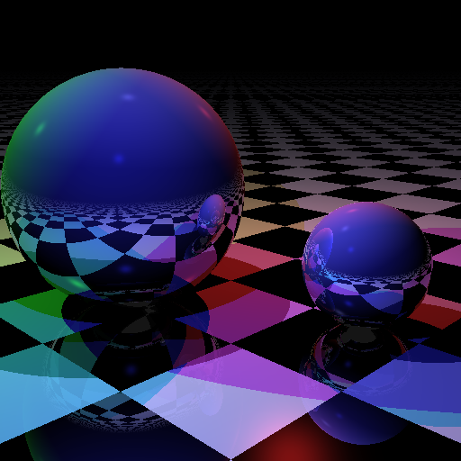

## `constexpr` for fun and... well, just fun ##

Tristan Brindle

C++ London, November 2018

---

### First, a plug... ###


---

### What is `constexpr`? ###

 * <!-- .element: class="fragment" -->Allows defining variables that are compile-time constants
 * <!-- .element: class="fragment" -->Allows defining functions which *may* be executed at compile-time
 * <!-- .element: class="fragment" -->Introduced in limited form in C++11
 * <!-- .element: class="fragment" -->Vastly expanded in C++14


```cpp
constexpr int add(int a, int b) {
    return a + b;
}

int main() {
    constexpr int i = 3;
    static_assert(add(i, 4) == 7);
}
```


`constexpr` limitations:

 * <!-- .element: class="fragment" -->No side effects
 * <!-- .element: class="fragment" -->No `new` or `delete`
 * <!-- .element: class="fragment" -->No virtual functions
 * <!-- .element: class="fragment" -->No `reinterpret_cast`
 * <!-- .element: class="fragment" -->No non-trivial destructors
 * <!-- .element: class="fragment" -->**No undefined behaviour**

---

 * **No UB** in `constexpr` functions executed at compile-time
 * <!-- .element: class="fragment" -->`constexpr` tests (via `static_assert`)
 * <!-- .element: class="fragment" -->"If it compiles, ship it"!

---

More `constexpr` == more good


How far can we take this...?




<!-- .element: class="fragment" -->Ray-traced image generated *entirely at compile-time* using C++ `constexpr` evaluation

---

May 2017: on Github

https://github.com/tcbrindle/raytracer.hpp

> <!-- .element: class="fragment" -->"That's cool, you should do a talk on it" -- Vittorio

> <!-- .element: class="fragment" -->"Nah" -- Me


October 2018:

<!-- .element: class="fragment" -->


---

### Confession time ###

<!-- .element: class="fragment" -->It was an accident (at first)

<!-- .element: class="fragment" -->I didn't set out to write a compile-time raytracer

<!-- .element: class="fragment" -->I don't actually know very much about raytracing at all

<!-- .element: class="fragment" -->I was just trying to learn!

---

### Learning about raytracing: ###

 1. Find a simple example online
 2. Translate into C++
 3. ???
 4. Profit


#### A simple raytracer ####

 * Microsoft TypeScript language samples

 * https://github.com/Microsoft/TypeScriptSamples/


```ts
class Vector {
    constructor(public x: number,
                public y: number,
                public z: number) {}
    static times(k: number, v: Vector) {
       return new Vector(k * v.x, k * v.y, k * v.z);
    }
    static minus(v1: Vector, v2: Vector) {
       return new Vector(v1.x - v2.x, v1.y - v2.y, v1.z - v2.z);
    }
    static plus(v1: Vector, v2: Vector) {
       return new Vector(v1.x + v2.x, v1.y + v2.y, v1.z + v2.z);
    }
    // ...
}
```


```cpp
struct vec3 {
    float x, y, z;
};

inline vec3 operator*(float k, const vec3& v) {
    return {k * v.x, k * v.y, k * v.z};
}

inline vec3 operator-(const vec3& v1, const vec3& v2) {
    return {v1.x - v2.x, v1.y - v2.y, v1.z - v2.z};
}

inline vec3 operator+(const vec3& v1, const vec3& v2) {
    return {v1.x + v2.x, v1.y + v2.y, v1.z + v2.z};
}
```


```cpp
struct vec3 {
    float x, y, z;
};

constexpr vec3 operator*(float k, const vec3& v) {
    return {k * v.x, k * v.y, k * v.z};
}

constexpr vec3 operator-(const vec3& v1, const vec3& v2) {
    return {v1.x - v2.x, v1.y - v2.y, v1.z - v2.z};
}

constexpr vec3 operator+(const vec3& v1, const vec3& v2) {
    return {v1.x + v2.x, v1.y + v2.y, v1.z + v2.z};
}
```


```ts
class Color {
    constructor(public r: number,
                public g: number,
                public b: number) {}
    // ...
    static white = new Color(1.0, 1.0, 1.0);
    static grey = new Color(0.5, 0.5, 0.5);
    static black = new Color(0.0, 0.0, 0.0);
    static background = Color.black;
    static defaultColor = Color.black;
}
```


```cpp
struct Color {
    float r, g, b;

    static constexpr Color white() { return { 1.0, 1.0, 1.0 }; }
    static constexpr Color grey() { return { 0.5, 0.5, 0.5 }; }
    static constexpr Color black() { return {}; };
    static constexpr Color background() { return black(); }
    static constexpr Color default_color() { return black(); }
};
```


```ts
interface Thing {
    intersect: (ray: Ray) => Intersection;
    normal: (pos: Vector) => Vector;
    surface: Surface;
}

class Sphere implements Thing {
    // ...
}
```


```cpp
struct Thing {
    virtual Intersection intersect(const Ray& ray) const = 0;
    virtual vec3 get_normal(const vec3& pos) const = 0;
    virtual const Surface& get_surface() const = 0;

    virtual ~Thing() = default;
};

struct Sphere : Thing {
    // ...
};
```


`constexpr` limitations:

 * No side effects
 * No `new` or `delete`
 * No virtual functions
 * No `reinterpret_cast`
 * No non-trivial destructors
 * No undefined behaviour


```cpp
struct Sphere;
struct Plane;

struct AnyThing {
    Intersection intersect(const Ray& ray) const;
    vec3 get_normal(const vec3& pos) const;
    const Surface& get_surface() const;

private:
    std::variant<Sphere, Plane> thing_;
};
 ```


 ```cpp
vec3 AnyThing::get_normal(const vec3& pos) const
{
    return std::visit([&](const auto& thing) {
        return thing.get_normal(pos);
    }, thing_);
}
 ```


 ```cpp
constexpr
vec3 AnyThing::get_normal(const vec3& pos) const
{
    return std::visit([&](const auto& thing) {
        return thing.get_normal(pos);
    }, thing_);
}
 ```


```cpp
struct Sphere;
struct Plane;

struct AnyThing {
    constexpr Intersection intersect(const Ray& ray) const;
    constexpr vec3 normal(const vec3& pos) const;
    constexpr const Surface& get_surface() const;

private:
    std::variant<Sphere, Plane> thing_;
};
 ```


```ts
interface Surface {
    diffuse: (pos: Vector) => Color;
    specular: (pos: Vector) => Color;
    reflect: (pos: Vector) => number;
    roughness: number;
}

export var shiny: Surface = {
    diffuse: function(pos) { return Color.white; },
    specular: function(pos) { return Color.grey; },
    reflect: function(pos) { return 0.7; },
    roughness: 250
}
```


```cpp
struct Surface {
    virtual Color get_diffuse(const vec3& pos) const = 0;
    virtual Color get_specular(const vec3& pos) const = 0;
    virtual float get_reflect(const vec3& pos) const = 0;
    virtual float get_roughness() const = 0;
    virtual ~Surface() = default;
};
```


```cpp
struct Surface {
    using diffuse_func_t = Color (*)(const vec3&);
    using specular_func_t = Color (*)(const vec3&);
    using reflect_func_t = float (*)(const vec3&);

    diffuse_func_t diffuse = nullptr;
    specular_func_t specular = nullptr;
    reflect_func_t reflect = nullptr;
    int roughness = 0;
};
```


```cpp
inline constexpr surface shiny{
        [](const vec3&) { return color::white(); },
        [](const vec3&) { return color::grey(); },
        [](const vec3&) { return 0.7f; },
        250
};
```


```ts
private shade(isect: Intersection, scene: Scene, depth: number) {
    var d = isect.ray.dir;
    var pos = Vector.plus(Vector.times(isect.dist, d), isect.ray.start);
    var normal = isect.thing.normal(pos);
    var reflectDir = Vector.minus(d, Vector.times(2, Vector.times(Vector.dot(normal, d), normal)));
    var naturalColor = Color.plus(Color.background,
                                  this.getNaturalColor(isect.thing, pos, normal, reflectDir, scene));
    var reflectedColor = (depth >= this.maxDepth) ? Color.grey : this.getReflectionColor(isect.thing, pos, normal, reflectDir, scene, depth);
    return Color.plus(naturalColor, reflectedColor);
}
```


```cpp
template <typename Scene>
constexpr color shade(const intersection& isect, const Scene& scene, int depth) const
{
    const vec3& d = isect.ray_.dir;
    const vec3 pos = (isect.dist * d) + isect.ray_.start;
    const vec3 normal = isect.thing_->get_normal(pos);
    const vec3 reflect_dir = d - (2 * (dot(normal, d) * normal));
    const color natural_color = color::background() + get_natural_color(*isect.thing_, pos, normal, reflect_dir, scene);
    const color reflected_color = depth >= max_depth ? color::grey() : get_reflection_color(*isect.thing_, pos, reflect_dir, scene, depth);
    return natural_color + reflected_color;
}
```


### Constexpr maths functions ###

 * <!-- .element: class="fragment" --> GCC (libstdc++) allows some maths functions to be called at compile-time
 * <!-- .element: class="fragment" --> Clang does not.
 * <!-- .element: class="fragment" --> Needed to reimplement some maths functions (not very well)


```cpp
// Compile-time square root using Newton-Raphson, adapted from
// https://gist.github.com/alexshtf/eb5128b3e3e143187794
constexpr float sqrt(float val)
{
    float curr = val;
    float prev = 0;

    while (curr != prev) {
        prev = curr;
        curr = 0.5 * (curr + val/curr);
    }

    return curr;
}
```

---

## Setting the scene ###

* <!-- .element: class="fragment" -->`struct RayTracer` has a member function `render()`
* <!-- .element: class="fragment" -->`RayTracer::render()` takes `Scene` and `Canvas` template params
* <!-- .element: class="fragment" -->Can make a `constexpr` `Scene` and `Canvas` using `std::array`
* <!-- .element: class="fragment" -->...or a runtime version using `std:vector`
* <!-- .element: class="fragment" -->Need to use `std::vector` to avoid constexpr evaluation -- omitting the keyword is not enough!


## Compiling ###

* <!-- .element: class="fragment" -->Around 45 minutes to render a 512x512px image at compile-time
* <!-- .element: class="fragment" -->...or less then half a second at run-time
* <!-- .element: class="fragment" -->~6000x faster!
* <!-- .element: class="fragment" -->Compiler memory use => unusable on GCC
* <!-- .element: class="fragment" -->Need to use `-fconstexpr-steps` with Clang


### The future ###


`constexpr` limitations (today):

 * No side effects
 * No `new` or `delete`
 * No virtual functions
 * No `reinterpret_cast`
 * No non-trivial destructors
 * No undefined behaviour


 `constexpr` limitations (C++20?):

 * No side effects
 * ~~No `new` or `delete`~~
 * ~~No virtual functions~~
 * No `reinterpret_cast`
 * ~~No non-trivial destructors~~
 * **No undefined behaviour**

---

 ### In conclusion ###

  * <!-- .element: class="fragment" -->It's possible to do almost anything at compile-time
  * <!-- .element: class="fragment" --> More constexpr == more good!
  * <!-- .element: class="fragment" -->...but you can have too much of a good thing

---

## Questions? ##

---

## Thanks very much ##

Twitter: @tristanbrindle

https://github.com/tcbrindle/raytracer.hpp
